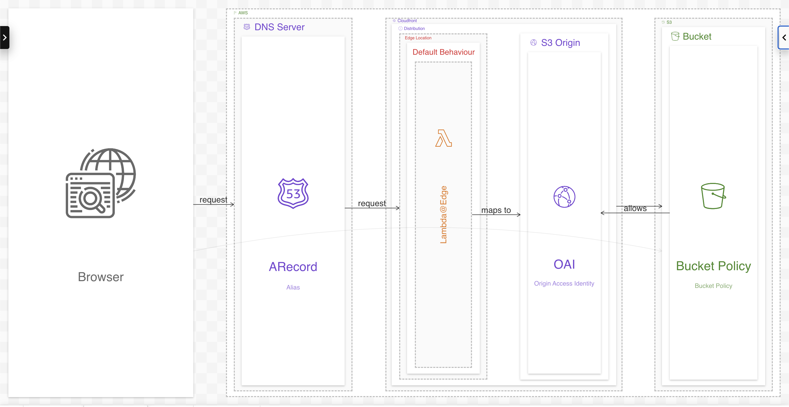

# CloudFront with OAI and S3

Example application to demonstrate how to use CloudFront's Origin Access Identity to 
protect S3 content from being accessed directly.

The project uses AWS CDK to provision an ALIAS record for the `DOMAIN_NAME` and points it to a CloudFront distribution.
A private S3 bucket with static site files is configured as a CloudFront Origin and used as the default behaviour with OAI attached.
A bucket policy is defined to only allow access to the Origin Access Identity.
The CloudFront behaviour is configured with a Lambda@edge on `Viewer Request` to ensure appropriate routing to static files.

Website files are uploaded to the s3 bucket during the infrastructure provisioning.

## Setup

Repository is split into two directories - `app` and `infrastructure`.

All commands are runnable from the root of the repository.

| Script           | Description                                                        |
|------------------|--------------------------------------------------------------------|
| npm start        | Starts the Node.js server                                          |
| npm run setup    | Installs all dependencies for project root, app and infrastructure |
| npm run synth    | Synthesizes the CDK stack                                          |
| npm run deploy   | Deploys the CDK stack                                              |
| npm run destroy  | Destroys the CDK stack                                             |
| npm run cleanup  | Removes all node_modules from project root, app and infrastructure |